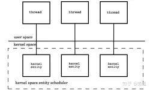
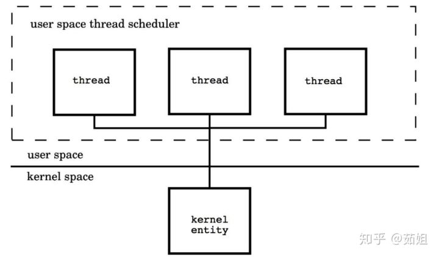
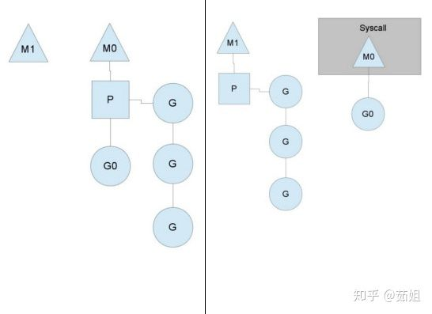
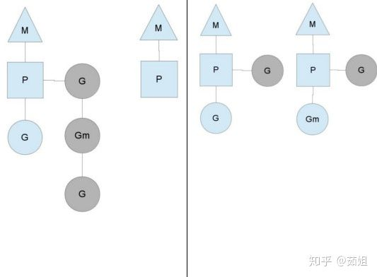
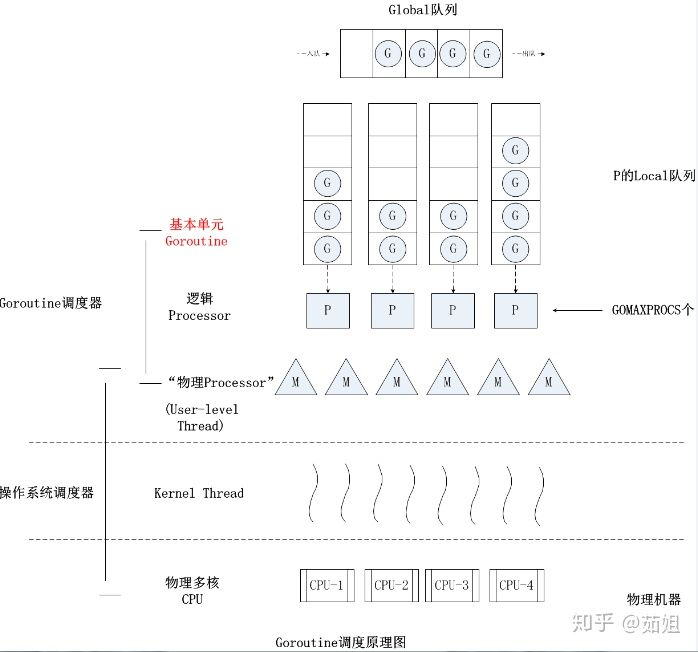

## **Go语言的并发模型**

Go 语言相比Java等一个很大的优势就是可以方便地编写并发程序。Go 语言内置了 goroutine 机制，使用goroutine可以快速地开发并发程序， 更好的利用多核处理器资源。接下来我们来了解一下Go语言的并发原理。

## **一、线程模型**

在现代操作系统中，线程是处理器调度和分配的基本单位，进程则作为资源拥有的基本单位。每个进程是由私有的虚拟地址空间、代码、数据和其它各种系统资源组成。线程是进程内部的一个执行单元。 每一个进程至少有一个主执行线程，它无需由用户去主动创建，是由系统自动创建的。 用户根据需要在应用程序中创建其它线程，多个线程并发地运行于同一个进程中。

我们先从线程讲起，无论语言层面何种并发模型，到了操作系统层面，一定是以线程的形态存在的。而操作系统根据资源访问权限的不同，体系架构可分为用户空间和内核空间；内核空间主要操作访问CPU资源、I/O资源、内存资源等硬件资源，为上层应用程序提供最基本的基础资源，用户空间呢就是上层应用程序的固定活动空间，用户空间不可以直接访问资源，必须通过“系统调用”、“库函数”或“Shell脚本”来调用内核空间提供的资源。

我们现在的计算机语言，可以狭义的认为是一种“软件”，它们中所谓的“线程”，往往是用户态的线程，和操作系统本身内核态的线程（简称KSE），还是有区别的。

Go并发编程模型在底层是由操作系统所提供的线程库支撑的，因此还是得从线程实现模型说起。

线程可以视为进程中的控制流。一个进程至少会包含一个线程，因为其中至少会有一个控制流持续运行。因而，一个进程的第一个线程会随着这个进程的启动而创建，这个线程称为该进程的主线程。当然，一个进程也可以包含多个线程。这些线程都是由当前进程中已存在的线程创建出来的，创建的方法就是调用系统调用，更确切地说是调用pthread create函数。拥有多个线程的进程可以并发执行多个任务，并且即使某个或某些任务被阻塞，也不会影响其他任务正常执行，这可以大大改善程序的响应时间和吞吐量。另一方面，线程不可能独立于进程存在。它的生命周期不可能逾越其所属进程的生命周期。

线程的实现模型主要有3个，分别是:用户级线程模型、内核级线程模型和两级线程模型。它们之间最大的差异就在于线程与内核调度实体( Kernel Scheduling Entity,简称KSE)之间的对应关系上。顾名思义，内核调度实体就是可以被内核的调度器调度的对象。在很多文献和书中，它也称为内核级线程，是操作系统内核的最小调度单元。

### **1.1 内核级线程模型**

用户线程与KSE是1对1关系(1:1)。大部分编程语言的线程库(如linux的pthread，Java的java.lang.Thread，C++11的std::thread等等)都是对操作系统的线程（内核级线程）的一层封装，创建出来的每个线程与一个不同的KSE静态关联，因此其调度完全由OS调度器来做。这种方式实现简单，直接借助OS提供的线程能力，并且不同用户线程之间一般也不会相互影响。但其创建，销毁以及多个线程之间的上下文切换等操作都是直接由OS层面亲自来做，在需要使用大量线程的场景下对OS的性能影响会很大。



每个线程由内核调度器独立的调度，所以如果一个线程阻塞则不影响其他的线程。

优点：在多核处理器的硬件的支持下，内核空间线程模型支持了真正的并行，当一个线程被阻塞后，允许另一个线程继续执行，所以并发能力较强。

缺点：每创建一个用户级线程都需要创建一个内核级线程与其对应，这样创建线程的开销比较大，会影响到应用程序的性能。

### **1.2 用户级线程模型**

用户线程与KSE是多对1关系(M:1)，这种线程的创建，销毁以及多个线程之间的协调等操作都是由用户自己实现的线程库来负责，对OS内核透明，一个进程中所有创建的线程都与同一个KSE在运行时动态关联。现在有许多语言实现的 **协程** 基本上都属于这种方式。这种实现方式相比内核级线程可以做的很轻量级，对系统资源的消耗会小很多，因此可以创建的数量与上下文切换所花费的代价也会小得多。但该模型有个致命的缺点，如果我们在某个用户线程上调用阻塞式系统调用(如用阻塞方式read网络IO)，那么一旦KSE因阻塞被内核调度出CPU的话，剩下的所有对应的用户线程全都会变为阻塞状态（整个进程挂起）。 所以这些语言的**协程库**会把自己一些阻塞的操作重新封装为完全的非阻塞形式，然后在以前要阻塞的点上，主动让出自己，并通过某种方式通知或唤醒其他待执行的用户线程在该KSE上运行，从而避免了内核调度器由于KSE阻塞而做上下文切换，这样整个进程也不会被阻塞了。



优点： 这种模型的好处是线程上下文切换都发生在用户空间，避免的模态切换（mode switch），从而对于性能有积极的影响。

缺点：所有的线程基于一个内核调度实体即内核线程，这意味着只有一个处理器可以被利用，在多处理器环境下这是不能够被接受的，本质上，用户线程只解决了并发问题，但是没有解决并行问题。如果线程因为 I/O 操作陷入了内核态，内核态线程阻塞等待 I/O 数据，则所有的线程都将会被阻塞，用户空间也可以使用非阻塞而 I/O，但是不能避免性能及复杂度问题。

### **1.3 两级线程模型**

用户线程与KSE是多对多关系(M:N)，这种实现综合了前两种模型的优点，为一个进程中创建多个KSE，并且线程可以与不同的KSE在运行时进行动态关联，当某个KSE由于其上工作的线程的阻塞操作被内核调度出CPU时，当前与其关联的其余用户线程可以重新与其他KSE建立关联关系。当然这种动态关联机制的实现很复杂，也需要用户自己去实现，这算是它的一个缺点吧。Go语言中的并发就是使用的这种实现方式，Go为了实现该模型自己实现了一个运行时调度器来负责Go中的"线程"与KSE的动态关联。此模型有时也被称为 **混合型线程模型**，**即用户调度器实现用户线程到KSE的“调度”，内核调度器实现KSE到CPU上的调度**。


**二、Go并发调度: G-P-M模型**

在操作系统提供的内核线程之上，Go搭建了一个特有的两级线程模型。goroutine机制实现了M : N的线程模型，goroutine机制是协程（coroutine）的一种实现，golang内置的调度器，可以让多核CPU中每个CPU执行一个协程。

### **2.1 调度器是如何工作的**

有了上面的认识，我们可以开始真正的介绍Go的并发机制了，先用一段代码展示一下在Go语言中新建一个“线程”(Go语言中称为Goroutine)的样子：

```go
// 用go关键字加上一个函数（这里用了匿名函数）
// 调用就做到了在一个新的“线程”并发执行任务
go func() { 
    // do something in one new goroutine
}()
```

功能上等价于Java8的代码:

```java
new java.lang.Thread(() -> { 
    // do something in one new thread
}).start();
```

理解goroutine机制的原理，关键是理解Go语言scheduler的实现。

Go语言中支撑整个scheduler实现的主要有4个重要结构，分别是M、G、P、Sched， 前三个定义在runtime.h中，Sched定义在proc.c中。

- Sched结构就是调度器，它维护有存储M和G的队列以及调度器的一些状态信息等。
- M结构是Machine，系统线程，它由操作系统管理的，goroutine就是跑在M之上的；M是一个很大的结构，里面维护小对象内存cache（mcache）、当前执行的goroutine、随机数发生器等等非常多的信息。
- P结构是Processor，处理器，它的主要用途就是用来执行goroutine的，它维护了一个goroutine队列，即runqueue。Processor是让我们从N:1调度到M:N调度的重要部分。
- G是goroutine实现的核心结构，它包含了栈，指令指针，以及其他对调度goroutine很重要的信息，例如其阻塞的channel。

> Processor的数量是在启动时被设置为环境变量GOMAXPROCS的值，或者通过运行时调用函数GOMAXPROCS()进行设置。Processor数量固定意味着任意时刻只有GOMAXPROCS个线程在运行go代码。

我们分别用三角形，矩形和圆形表示Machine Processor和Goroutine。


在单核处理器的场景下，所有goroutine运行在同一个M系统线程中，每一个M系统线程维护一个Processor，任何时刻，一个Processor中只有一个goroutine，其他goroutine在runqueue中等待。一个goroutine运行完自己的时间片后，让出上下文，回到runqueue中。 多核处理器的场景下，为了运行goroutines，每个M系统线程会持有一个Processor。


在正常情况下，scheduler会按照上面的流程进行调度，但是线程会发生阻塞等情况，看一下goroutine对线程阻塞等的处理。

### **2.2 线程阻塞**

当正在运行的goroutine阻塞的时候，例如进行系统调用，会再创建一个系统线程（M1），当前的M线程放弃了它的Processor，P转到新的线程中去运行。



**2.3 runqueue执行完成**

当其中一个Processor的runqueue为空，没有goroutine可以调度。它会从另外一个上下文偷取一半的goroutine。



> 其图中的G，P和M都是Go语言运行时系统（其中包括内存分配器，并发调度器，垃圾收集器等组件，可以想象为Java中的JVM）抽象出来概念和数据结构对象：G：Goroutine的简称，上面用go关键字加函数调用的代码就是创建了一个G对象，是对一个要并发执行的任务的封装，也可以称作用户态线程。属于用户级资源，对OS透明，具备轻量级，可以大量创建，上下文切换成本低等特点。M：Machine的简称，在linux平台上是用clone系统调用创建的，其与用linux pthread库创建出来的线程本质上是一样的，都是利用系统调用创建出来的OS线程实体。M的作用就是执行G中包装的并发任务。**Go运行时系统中的调度器的主要职责就是将G公平合理的安排到多个M上去执行**。其属于OS资源，可创建的数量上也受限了OS，通常情况下G的数量都多于活跃的M的。P：Processor的简称，逻辑处理器，主要作用是管理G对象（每个P都有一个G队列），并为G在M上的运行提供本地化资源。

从两级线程模型来看，似乎并不需要P的参与，有G和M就可以了，那为什么要加入P这个东东呢？其实Go语言运行时系统早期(Go1.0)的实现中并没有P的概念，Go中的调度器直接将G分配到合适的M上运行。但这样带来了很多问题，例如，不同的G在不同的M上并发运行时可能都需向系统申请资源（如堆内存），由于资源是全局的，将会由于资源竞争造成很多系统性能损耗，为了解决类似的问题，后面的Go（Go1.1）运行时系统加入了P，让P去管理G对象，M要想运行G必须先与一个P绑定，然后才能运行该P管理的G。这样带来的好处是，我们可以在P对象中预先申请一些系统资源（本地资源），G需要的时候先向自己的本地P申请（无需锁保护），如果不够用或没有再向全局申请，而且从全局拿的时候会多拿一部分，以供后面高效的使用。就像现在我们去政府办事情一样，先去本地政府看能搞定不，如果搞不定再去中央，从而提供办事效率。而且由于P解耦了G和M对象，这样即使M由于被其上正在运行的G阻塞住，其余与该M关联的G也可以随着P一起迁移到别的活跃的M上继续运行，从而让G总能及时找到M并运行自己，从而提高系统的并发能力。Go运行时系统通过构造G-P-M对象模型实现了一套用户态的并发调度系统，可以自己管理和调度自己的并发任务，所以可以说Go语言**原生支持并发**。**自己实现的调度器负责将并发任务分配到不同的内核线程上运行，然后内核调度器接管内核线程在CPU上的执行与调度。**

可以看到Go的并发用起来非常简单，用了一个语法糖将内部复杂的实现结结实实的包装了起来。其内部可以用下面这张图来概述：



写在最后，Go运行时完整的调度系统是很复杂，很难用一篇文章描述的清楚，这里只能从宏观上介绍一下，让大家有个整体的认识。

```go
// Goroutine1
func task1() {
    go task2()
    go task3()
}
```

假如我们有一个G(Goroutine1)已经通过P被安排到了一个M上正在执行，在Goroutine1执行的过程中我们又创建两个G，这两个G会被马上放入与Goroutine1相同的P的本地G任务队列中，排队等待与该P绑定的M的执行，这是最基本的结构，很好理解。 关键问题是:**a.如何在一个多核心系统上尽量合理分配G到多个M上运行，充分利用多核，提高并发能力呢？**如果我们在一个Goroutine中通过**go**关键字创建了大量G，这些G虽然暂时会被放在同一个队列, 但如果这时还有空闲P（系统内P的数量默认等于系统cpu核心数），Go运行时系统始终能保证至少有一个（通常也只有一个）活跃的M与空闲P绑定去各种G队列去寻找可运行的G任务，该种M称为**自旋的M**。一般寻找顺序为：自己绑定的P的队列，全局队列，然后其他P队列。如果自己P队列找到就拿出来开始运行，否则去全局队列看看，由于全局队列需要锁保护，如果里面有很多任务，会转移一批到本地P队列中，避免每次都去竞争锁。如果全局队列还是没有，就要开始玩狠的了，直接从其他P队列偷任务了（偷一半任务回来）。这样就保证了在还有可运行的G任务的情况下，总有与CPU核心数相等的M+P组合 在执行G任务或在执行G的路上(寻找G任务)。**b. 如果某个M在执行G的过程中被G中的系统调用阻塞了，怎么办？**在这种情况下，这个M将会被内核调度器调度出CPU并处于阻塞状态，与该M关联的其他G就没有办法继续执行了，但Go运行时系统的一个监控线程(sysmon线程)能探测到这样的M，并把与该M绑定的P剥离，寻找其他空闲或新建M接管该P，然后继续运行其中的G，大致过程如下图所示。然后等到该M从阻塞状态恢复，需要重新找一个空闲P来继续执行原来的G，如果这时系统正好没有空闲的P，就把原来的G放到全局队列当中，等待其他M+P组合发掘并执行。


**c. 如果某一个G在M运行时间过长，有没有办法做抢占式调度，让该M上的其他G获得一定的运行时间，以保证调度系统的公平性?**我们知道linux的内核调度器主要是基于时间片和优先级做调度的。对于相同优先级的线程，内核调度器会尽量保证每个线程都能获得一定的执行时间。为了防止有些线程"饿死"的情况，内核调度器会发起抢占式调度将长期运行的线程中断并让出CPU资源，让其他线程获得执行机会。当然在Go的运行时调度器中也有类似的抢占机制，但并不能保证抢占能成功，因为Go运行时系统并没有内核调度器的中断能力，它只能通过向运行时间过长的G中设置抢占flag的方法温柔的让运行的G自己主动让出M的执行权。 说到这里就不得不提一下Goroutine在运行过程中可以动态扩展自己线程栈的能力，可以从初始的2KB大小扩展到最大1G（64bit系统上），因此在每次调用函数之前需要先计算该函数调用需要的栈空间大小，然后按需扩展（超过最大值将导致运行时异常）。Go抢占式调度的机制就是利用在判断要不要扩栈的时候顺便查看以下自己的抢占flag，决定是否继续执行，还是让出自己。运行时系统的监控线程会计时并设置抢占flag到运行时间过长的G，然后G在有函数调用的时候会检查该抢占flag，如果已设置就将自己放入全局队列，这样该M上关联的其他G就有机会执行了。但如果正在执行的G是个很耗时的操作且没有任何函数调用(如只是for循环中的计算操作)，即使抢占flag已经被设置，该G还是将一直霸占着当前M直到执行完自己的任务。